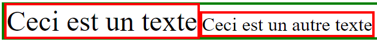

## Le problème

```html
<body>
  <div style="border: 1px solid green">
    <span style="border: 1px solid red; font-size: 12px;">Ceci est un texte</span>
  </div>
</body>

```


## Solutions

- Utiliser `display: flex` à la place de `display: block` sur le container :

```html
<body>
  <div style="border: 1px solid green; display: flex">
    <span style="border: 1px solid red; font-size: 12px">Ceci est un texte</span>
    <span style="border: 1px solid red; font-size: 8px">Ceci est un autre texte</span>
  </div>
</body>
```


- Paramétrer les propriétés `font-size`, `letter-spacing` et `word-spacing` du container à `0px` et réinitialiser les enfants :

```html
<body>
  <div style="border: 1px solid green; font-size: 0px; letter-spacing: 0px; word-spacing: 0px">
    <span style="all: initial; border: 1px solid red; font-size: 12px">Ceci est un texte</span>
    <span style="all: initial; border: 1px solid red; font-size: 8px">Ceci est un autre texte</span>
  </div>
</body>
```



- Utiliser la propriété `float: left` sur chaque enfant :

```html
<body>
  <div style="border: 1px solid green">
    <span style="border: 1px solid red; float: left; font-size: 12px">Ceci est un texte</span>
    <span style="border: 1px solid red; float: left; font-size: 8px">Ceci est un autre texte</span>
  </div>
</body>
```


## Sources

- [https://stackoverflow.com/questions/1833734/display-inline-block-extra-margin/8262649#8262649](https://stackoverflow.com/questions/1833734/display-inline-block-extra-margin/8262649#8262649)
